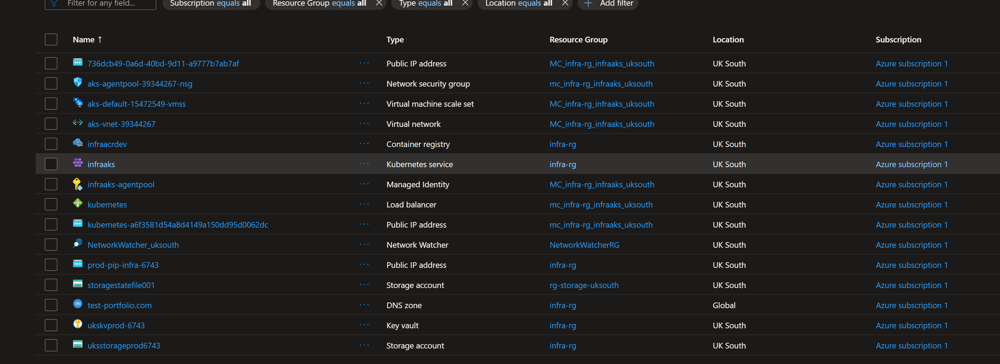

# AKS Portfolio Project with Terraform and GitHub Actions
This repository demonstrates the end-to-end deployment of a portfolio application running on Kubernetes via Terraform, GitHub actions and hosted in Azure Kubernetes Service (AKS).
It’s built to showcase your DevOps / Platform Engineering skills: IaC, CI/CD (GitHub Actions), monitoring stack, modular Terraform, Kubernetes manifests, and a sample application deployment.

## Table of Contents
- [Architecture Diagram](#architecture-diagram)

## Architecture Diagram

## Local Setup
1. **Install dependencies**:
   ```bash
   npm 
   npm start
   npm run build
   ```
2. Then browse the application: 
   ```bash
   http://localhost:3000/
   ```
## Repository structure
        ```bash
        /terraform            # Terraform modules & root configs for Azure resources
            ├─ modules/
            ├─ environments/
            └─ main.tf, variables.tf, outputs.tf
        /k8s                  # Kubernetes manifests/Helm charts for workloads & monitoring
            ├─ app/
            └─ monitoring/
        /application           # Sample portfolio application (e.g., web UI, API)
            ├─ frontend/
            └─ backend/
        /.github/workflows    # GitHub Actions workflows: CI, CD, infrastructure deploy
        .gitignore  
        deploy-monitoring.sh   # script to bootstrap monitoring stack manually if required
        ```

The repo is organised around three domains:

- **terraform/**: provisioning Azure infrastructure using modules (AKS cluster, networking, ACR, Key Vault, etc)
- **k8s/**: Kubernetes manifests
- **application/**: sample portfolio (web front-end + back-end) to deploy into AKS
- **.github/workflows/**: CI/CD pipelines for build, test, deploy.

## Tech Stack used

- ### Azure
    - Leveraged tools such as RBAC, Load balancer, VMSS, ACR (Azure Container Registry), AKS (Azure Kuebernetes Service).  
- ###  Docker
  - The `Dockerfile` defines how the app is containerised
  - The `docker-compose.yml` file provides a simplified local development setup that builds and runs the containerized application.
  - **Multi-stage** build was used to optimise the image size by separating build dependencies from the final lightweight runtime image.
- ### Terraform
  - Used to provision and manage all Azure resources consistently.
  - Utilised Helm provider to deploy Grafana and Prometheus directly onto the Azure AKS cluster, eliminating the need for separate shell scripts or manual configuration.
  - Applied the **DRY (Don't Repeat Yourself)** principle by structuring the code into reusable modules, with the root main.tf orchestrating all child modules from a single configuration.
  - Configured a Storage Account as a remote backend for the Terraform state file, enabling secure collaboration through state lockingand seamless integration with CI/CD workflows.
- ### GitHub Actions 
    - Triggers infrastructure builds either through manual approval or by automatically detecting changes in the Terraform directory.
    - Automates the Docker image build, pushes it to ACR and applies Kubernetes manifest files to deploy the microservice infrastructure.
    -  Builds and scans Docker images using **Trivy**, analyses Terraform configuration files with **Checkov** and performs vulnerability assessments via **SonarCloud**.
    - Destroy infrastucture through manual approval to avoid human-error incidents. 
    - Sends workflow runs alerts to **Microsoft Teams** for improved visibility and traceability.
    - Utilised GitHub Secrets to securely pass sensitive values into workflows, ensuring they are not exposed in the repository or logs.
- ### Monitoring and Observability 
    - Used **Prometheus** for metrics collection.
    - Deployed **Grafana** for metrics visualisation and interactive dashboards.
    - To maintain security best practices, the **Grafana admin password** is automatically stored in Azure Key Vault during deployment, preventing any potential password exposure.

## Project screenshots: 
### All Azure resources



### 


